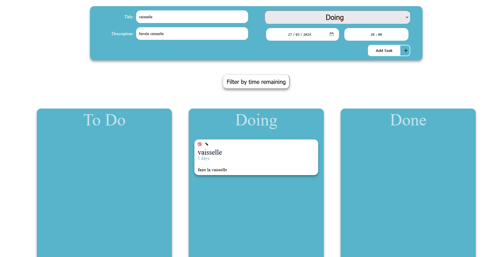

# Projet_planner

Ce projet présente une application de liste de tâches (To-Do List) qui permet à l'utilisateur de gérer ses tâches. L'application permet à l'utilisateur d'ajouter, de supprimer et de marquer comme terminées les tâches.

### Sommaire

1. [Description du Projet](#description)
2. [Captures d'écran](#captures-décran)
3. [Installation et Utilisation](#installation)
4. [Ressources Utilisées](#langages)

## 📌 Détails du Projet

### Description

Ce projet propose une application de liste de tâches qui permet à l'utilisateur d'ajouter, de supprimer et de marquer comme terminées les tâches, tout en offrant une visualisation claire des engagements à venir. Les fonctionnalités incluent l'ajout de descriptions et de dates d'échéance, la suppression des tâches obsolètes, le marquage des tâches accomplies, ainsi qu'une interface intuitive pour une gestion efficace des responsabilités quotidiennes, hebdomadaires ou mensuelles.

https://dams4953.github.io/Projet_planner/

### Captures d'Écran

## 📌 Installation et Utilisation

### Installation
1. Clonez le repo.
2. Accédez au répertoire du projet.
3. Assurez-vous d'avoir npm installés sur votre machine.
4. Assurez-vous d'avoir Sass installé. (npm install sass --save-dev).
5. L'application sera disponible sur votre localhost.

### Utilisation
- Pour ajouter une nouvelle tâche, saisissez les informations dans les champs de saisie prévus à cet effet et cliquez sur "Add Task".
- Une fois ajoutée, la tâche apparaîtra dans la liste "To Do", "Doing", "Done" selon ce que vous avez choisi.
- Pour supprimer une tâche, cliquez sur l'icône de corbeille dans la tâche correspondante.
- Pour déplacer et/ou modifier une tâche, cliquez sur le crayon.
- Vous pouvez visualiser les tâches à venir, celles en cours et celles déjà terminées pour organiser votre emploi du temps.

## 📌 Ressources Utilisées

### Langages

## 📌 Auteurs

- [Jérémy](https://github.com/jezeville)
- [Damien](https://github.com/Dams4953)

